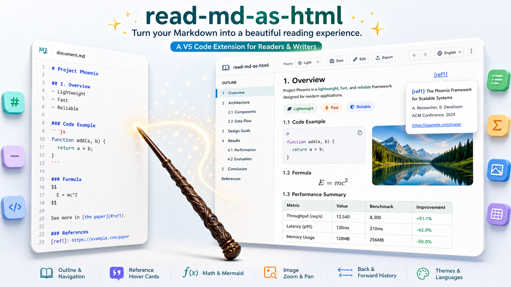
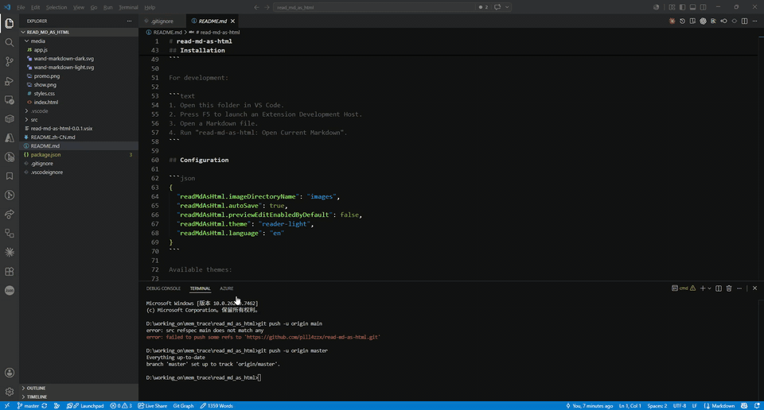
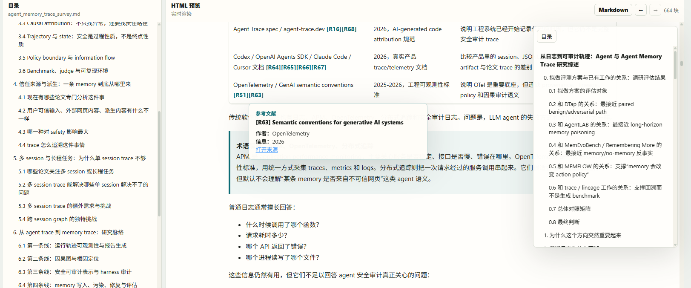
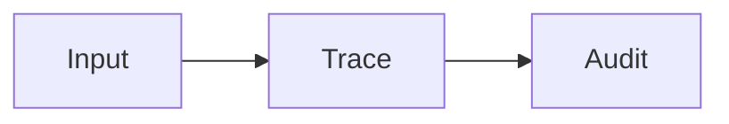

# read-md-as-html

Read, edit, and navigate Markdown as a rich HTML document inside VS Code.

[Chinese README](README.zh-CN.md)



`read-md-as-html` is a local-first VS Code extension for long Markdown documents: research surveys, paper notes, technical reports, design docs, and anything that benefits from a polished reading view.

It keeps Markdown as the source of truth while giving you an HTML reader with a project file tree, outline, search, hover cards, formulas, Mermaid diagrams, rich tables, source-line mapping, image zooming, cross-file reading history, margin notes, scroll-rail previews, and side-by-side editing.

## Demo



## Highlights

- **Markdown and HTML side by side**: edit Markdown on the left, read the rendered HTML on the right.
- **Focused reading by default**: the Markdown pane starts collapsed and can be reopened whenever you want side-by-side editing.
- **Movable pane boundaries**: resize outline, Markdown, and preview panes.
- **Outline everywhere**: left document outline plus a collapsible outline inside the HTML preview.
- **Project Markdown tree**: browse Markdown and LaTeX files across project subfolders. The current file's folder opens by default, other folders stay collapsed, and pinned files appear as a compact top list with full paths on hover.
- **File actions**: right-click a file in the project tree to copy its absolute or project-relative path. Markdown links in the preview can switch to same-folder files or open linked files from other folders in a new reader tab.
- **Adjustable HTML reading size**: change the preview font size from the toolbar without touching the Markdown source.
- **Built-in search**: press `Ctrl+F` / `Cmd+F` to search rendered preview text, highlight all matches, jump with Enter / Shift+Enter, or use the previous/next buttons beside the search box.
- **Reference hover cards**: hover over `[R1]` citations to see title, authors, venue or journal, source metadata, and links.
- **Section hover cards**: hover internal section links to preview the target section.
- **Source line map**: the HTML preview can show a left-side source axis that maps rendered paragraphs, figures, tables, formulas, and diagrams back to Markdown source lines.
- **Reader annotations**: select text in the HTML preview to highlight it, add a bookmark, or write a note. Notes render as connected margin cards on wide previews and compact hover cards on narrow previews.
- **Smart scroll rail**: hover the right-side rail to preview nearby content, click the rail to jump, drag it to scroll, and use bookmark/note markers for context hover cards and click-to-jump navigation.
- **Math and Mermaid support**: render formulas and Mermaid diagrams in the preview.
- **Research-friendly tables**: wide tables support sticky header and first column, column resizing, table resizing from the bottom-right corner, scroll/pan navigation, column filters, and persisted table layouts.
- **Image workflow**: paste screenshots, save them locally, and insert Markdown image syntax automatically.
- **Image and Mermaid lightbox**: click to zoom, scroll to scale, and drag to inspect details.
- **Cross-file reading history**: go back and forward between reading positions even after switching Markdown files in the same project.
- **Persistent reading progress**: reopen a Markdown file at the last reading position instead of starting from the top.
- **Document-local state**: notes, bookmarks, and highlights are stored inside the Markdown file; reading progress, pinned file state, table layouts, and exported HTML default to one `.md/` folder at the project root.
- **Large-document optimizations**: project file lists are cached, preview switching avoids unnecessary file-tree rebuilds, and scroll updates are throttled for smoother long-document reading.
- **Themes and languages**: switch between light, soft green, VS Code, and dark themes; switch UI language between English and Chinese.
- **No backend server**: everything runs inside the VS Code Webview.

## Screenshot



## Compared With VS Code's Built-In Markdown Preview

VS Code's native Markdown preview is excellent for quick checks. `read-md-as-html` focuses on long-form reading and research workflows:

| Capability | VS Code built-in preview | read-md-as-html |
| --- | --- | --- |
| Long-document navigation | Document outline is separate from the preview workflow. | Project Markdown tree, document outline, and HTML outline live in one reader. |
| Cross-file reading | Back/forward does not track reading positions across Markdown files. | Back/forward can jump across files and restore the exact reading position. |
| Search | Browser/editor search is not optimized for this custom reading workflow. | Built-in rendered-text search with match count, highlights, previous/next buttons, and keyboard navigation. |
| Reader annotations | No built-in highlight, bookmark, or note layer for the rendered document. | Highlights, bookmarks, notes, scroll-rail markers, margin-note cards, and delete controls. |
| Citation and section preview | Links open or jump, but do not provide rich reading context. | Hover cards for references, citations, sections, bookmarks, notes, and scroll-rail positions. |
| Source traceability | Rendered HTML does not show which Markdown lines produced each paragraph, figure, or table. | Source axis maps rendered blocks back to Markdown line ranges and can jump to the source line. |
| Wide tables | Tables render, but large comparison tables are hard to inspect interactively. | Sticky header/first column, column resizing, table resizing, filters, pan/scroll navigation, and persistent table layouts. |
| Screenshot workflow | Pasted images usually require manual file management and Markdown edits. | Paste screenshots, save them locally, and insert Markdown image syntax automatically. |
| Figure inspection | Images render inline; detailed inspection is limited. | Images and Mermaid diagrams open in a zoom/pan lightbox. |
| Reading ergonomics | Good for quick preview checks. | Reader themes, adjustable HTML font size, collapsed Markdown pane, and resizable panes. |
| State transparency | Preview state is mostly editor/session behavior. | Annotations live in Markdown; reading progress, pinned files, and table layouts live in the project-root `.md/` folder. |

## Commands

```text
read-md-as-html: Open Current Document
read-md-as-html: Open Preview Only
read-md-as-html: Export Current Document as Reader HTML
```

The main command is also available from the editor title bar and the Explorer context menu for `.md`, `.markdown`, and `.tex` files.

## Installation

Install a packaged VSIX:

```powershell
code.cmd --install-extension .\read-md-as-html-0.0.6.vsix
```

Before debugging, run `npm ci` and `npm run build` with Node.js 24.15 or newer. Rebuild after editing `webview/`, then reload the development window.

For development:

```text
1. Open this folder in VS Code.
2. Press F5 to launch an Extension Development Host.
3. Open a Markdown file.
4. Run "read-md-as-html: Open Current Document".
```

### Linux Webview startup error

If VS Code reports `Could not register service worker`, the failure occurs in the VS Code Webview container before this extension's HTML starts. The extension automatically retries once and then offers a window reload or a Linux repair command.

For a persistent error, fully quit every VS Code window and run:

```bash
rm -rf "${XDG_CONFIG_HOME:-$HOME/.config}/Code/Service Worker" \
       "${XDG_CONFIG_HOME:-$HOME/.config}/Code/Cache" \
       "${XDG_CONFIG_HOME:-$HOME/.config}/Code/CachedData" \
       "${XDG_CONFIG_HOME:-$HOME/.config}/Code/GPUCache"
```

Restart VS Code as a normal user, not through `sudo`. For VS Code Insiders or VSCodium, replace the `Code` directory with the corresponding application directory. In Remote SSH sessions, clear the cache on the machine displaying the VS Code UI, not the remote project host. This does not remove project files, settings, extensions, Markdown annotations, or the project `.md/` state directory.

## Configuration

```json
{
  "readMdAsHtml.imageDirectoryName": "images",
  "readMdAsHtml.autoSave": true,
  "readMdAsHtml.previewEditEnabledByDefault": false,
  "readMdAsHtml.theme": "reader-light",
  "readMdAsHtml.language": "en"
}
```

Available themes:

- `reader-light`
- `soft-green`
- `vscode`
- `dark`

Available languages:

- `en`
- `zh-CN`

## Storage Model

- Highlights, bookmarks, and notes are written to a hidden HTML comment block at the end of the Markdown file.
- Reading progress and table layouts are stored in `<project-root>/.md/<relative-markdown-path>.read-md-as-html.json`.
- Pinned file order is stored in `<project-root>/.md/read-md-as-html.folder.json`.
- Exported HTML defaults to `<project-root>/.md/<relative-markdown-path>.html`.
- When the project-root `.md/` cache folder is created, the extension also ensures `<project-root>/.gitignore` contains `.md/`.
- No annotation or reading-progress state is intentionally kept in VS Code system cache; older workspaceState data is migrated on open.

## Markdown Authoring Scheme

The extension works best when Markdown documents follow a stable structure. The goal is to keep Markdown readable as plain text while making it easy to transform into a rich HTML reading experience.

### Basic Principles

- Markdown is the source of truth.
- Use UTF-8.
- Prefer standard Markdown syntax.
- Avoid unnecessary raw HTML.
- Put images and assets next to the Markdown file or in a nearby subdirectory.
- Store pasted images in `images/` by default.
- Use relative paths, not absolute local paths.
- Do not store images as base64.

Recommended project structure:

```text
project/
  docs/
    survey.md
    images/
      trace-graph.png
      pasted-20260607-153012-123.png
```

### Recommended Document Structure

```markdown
# Title

> Date: YYYY-MM-DD
> Scope: Data sources, papers, repositories, or systems covered by this document.

## 1. Background And Problem
## 2. Core Concepts
## 3. Methods Or System Categories
## 4. Comparison Table
## 5. Engineering Takeaways
## 6. Gaps And Follow-Up Questions
## References

[R1] Author. *Title*. Source, Year. URL
```

For long documents, each major section should usually answer:

- What question does this section answer?
- What sources or related work does it cover?
- What method, evidence, or comparison is used?
- What are the limitations?
- How does it connect to the document topic?

### Headings And Anchors

Use standard Markdown headings:

```markdown
# Document Title
## 1. Top-Level Section
### 1.1 Second-Level Section
```

Rules:

- Do not skip heading levels.
- Make headings readable.
- Use numbered headings for long documents.
- Use explicit anchors when a section needs a stable link:

```markdown
## 2.2 OpenTelemetry: Important Foundation {#opentelemetry-foundation}
```

Internal link example:

```markdown
See the [OpenTelemetry section](#opentelemetry-foundation).
```

### References

Use `[Rnumber]` citations in the body:

```markdown
HarnessAudit notes that final-output-only auditing can miss privilege violations inside the trace [R9].
Multiple citations can be written consecutively [R10][R14][R46].
```

Put references under `## References`:

```markdown
[R9] Chengzhi Liu et al. *Auditing Agent Harness Safety*. arXiv:2605.14271, 2026. https://arxiv.org/abs/2605.14271
```

Recommended field order:

```text
[Rnumber] Author. *Title*. Venue or note, Year. URL
```

Rules:

- Each reference number must be unique.
- Every body citation must have a matching reference entry.
- Wrap titles with `*Title*`.
- Put authors before the title.
- If there is no author, start from the title, but do not invent authors.
- Put the URL at the end.

Accepted no-author format:

```markdown
[R16] *Agent Trace: Open Specification for Tracking AI-Generated Code*. Version 0.1.0 RFC, 2026. https://agent-trace.dev/
```

Explicit author-field format:

```markdown
[R1] Authors: Adam AlSayyad, Kelvin Yuxiang Huang, Richik Pal. *AgentTrace: A Structured Logging Framework for Agent System Observability*. arXiv:2602.10133, 2026. https://arxiv.org/abs/2602.10133
```

### Formulas

Inline formula:

```markdown
Here $S$ is the trace surface, and $E$ is the event content.
```

Block formula:

```markdown
$$
L(S,E,C)\to R
$$
```

Rules:

- Leave blank lines before and after block formulas.
- Do not put Markdown links inside formulas.
- Explain variables when they first appear.

### Images

Use standard Markdown image syntax. To avoid this README being parsed as a broken image by package tools, the example below includes spaces:

```markdown
! [Trace graph overview] (images/trace_graph.png)
```

When writing a real document, remove the spaces after `!` and before `(`.

Rules:

- Use relative image paths.
- Put image files in `images/` or another suitable asset directory.
- Write readable alt text.
- Do not use base64 image data.
- Prefer lowercase English, numbers, hyphens, and underscores in filenames.

Recommended names:

```text
images/memory-lineage-graph.png
images/agent-trace-pipeline.png
images/pasted-20260607-153012-123.png
```

Avoid:

```text
images/screenshot 1 (final).png
C:\Users\name\Desktop\figure.png
data:image/png;base64,...
```

### Mermaid

Use fenced Mermaid code blocks:

````markdown

````

Rules:

- Leave blank lines before and after Mermaid blocks.
- Keep node text short.
- Put non-English node labels inside quotes.
- Put long explanations before or after the diagram.
- Use Mermaid for structure, flow, dependencies, and classification.

### Tables, Lists, And Code

Use standard Markdown tables:

```markdown
| Work | Focus | Takeaway |
| --- | --- | --- |
| MemLineage [R10] | memory lineage | Preserve derivation chains |
```

Use fenced code blocks with language names:

````markdown
```json
{"trace_id": "abc", "event": "memory_write"}
```
````

Rules:

- Keep table cells short.
- Do not use multi-line table cells.
- Put long explanations outside tables.
- Avoid deeply nested lists.
- Keep code blocks for code, configuration, or structured examples.

### Writing Style

- Explain the problem first, then introduce the method.
- State the conclusion first, then provide evidence.
- Explain concepts when they first appear.
- Do not pile citations at the end of a paragraph without explaining what they support.
- Split long paragraphs for better HTML reading.

### Post-Generation Checklist

- Heading levels are continuous.
- The outline is clear.
- Explicit anchors are unique.
- Image paths are relative.
- Image files exist.
- Mermaid blocks are closed.
- Formula delimiters are closed.
- Table separator rows are correct.
- Every body citation has a reference entry.
- Reference titles are wrapped with `*Title*`.
- Reference author, title, source, year, and URL fields are clear.
- There is no unnecessary raw HTML or base64 image content.

## Offline reading and HTML export

Marked, DOMPurify, Turndown, MathJax, Mermaid and equation fonts are installed with the VSIX. Rendering libraries do not load from a CDN. Remote images in the source still require network access. If the sanitizer is unavailable, the reader displays escaped source instead of inserting unsanitized HTML.

The toolbar and command-palette export use the same renderer to produce a single browser-readable HTML file. The command opens a reader panel before showing the save dialog. Unsaved editor content is included.

- Styles, local images and equation fonts are embedded; rendered equations and Mermaid figures are preserved.
- The standalone reader includes an outline, text search, column text filters, theme and font controls, image zoom and pan, internal-link previews, and printing.
- Highlights and note contents are preserved in the snapshot. The export is read-only and does not write back to source files or cross-file reading state.
- Tables include all rows; exported filters operate independently of the editor's filters.
- Remote images retain their online URLs. Missing local images show a placeholder; resources that were not embedded are reported after saving.
- Export covers one document, not a document collection. Links to other local Markdown documents are not retained as portable reader links.

## Development structure and validation

Frontend source lives in `webview/`, with separate modules for document parsing, render scheduling, tables, annotations, navigation, search, images, editing and export. `state.js` contains shared state and `main.js` starts the app. Modules use explicit imports.

`npm run build` generates `media/app.js`, the standalone reader script and `dist/extension.cjs`, and copies local rendering assets with their licenses. Edit source modules rather than generated scripts. `package-lock.json` pins dependency versions and integrity hashes.

`npm test` checks math blocks, sanitization and fallback, table filters, annotations, Webview initialization and standalone exports. Run `node scripts/preview.cjs` for a local browser check on port 8765, or pass a document path and open `/?document`. The preview host does not modify the source; test exports are saved to `.md/reader-smoke.html` in this project.

## Packaging

Build a VSIX package:

```powershell
npm ci
npm test
npm run package
```

## Publishing

Before publishing to the VS Code Marketplace:

- Replace the placeholder `publisher` in `package.json`.
- Add `repository`.
- Add a `LICENSE` file.

```powershell
npx.cmd --yes @vscode/vsce@latest login <publisher-id>
npx.cmd --yes @vscode/vsce@latest publish --no-dependencies
```

You can also upload the generated `.vsix` manually from the Visual Studio Marketplace publisher management page.

## Roadmap

- Vendored local MathJax and Mermaid assets for offline use.
- Multi-document project navigation.
- Richer export modes.
- Better preview editing for complex Markdown blocks.
- More themes and layout presets.
