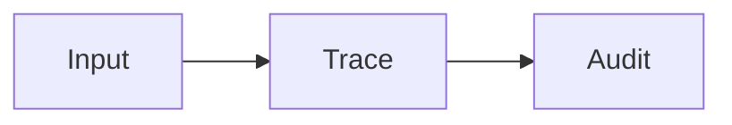

# read-md-as-html

Read, edit, and navigate Markdown as a rich HTML document inside VS Code.

[Chinese README](README.zh-CN.md)


`read-md-as-html` is a local-first VS Code extension for long Markdown documents: research surveys, paper notes, technical reports, design docs, and anything that benefits from a polished reading view.

It keeps Markdown as the source of truth while giving you an HTML reader with an outline, hover cards, formulas, Mermaid diagrams, image zooming, reading history, and side-by-side editing.

## Demo


## Highlights

- **Markdown and HTML side by side**: edit Markdown on the left, read the rendered HTML on the right.
- **Collapsible Markdown pane**: hide the Markdown editor when you want a focused reading mode.
- **Movable pane boundaries**: resize outline, Markdown, and preview panes.
- **Outline everywhere**: left document outline plus a collapsible outline inside the HTML preview.
- **Reference hover cards**: hover over `[R1]` citations to see title, authors, source metadata, and links.
- **Section hover cards**: hover internal section links to preview the target section.
- **Math and Mermaid support**: render formulas and Mermaid diagrams in the preview.
- **Image workflow**: paste screenshots, save them locally, and insert Markdown image syntax automatically.
- **Image and Mermaid lightbox**: click to zoom, scroll to scale, and drag to inspect details.
- **Reading history**: go back and forward between reading positions after jumps or scrolling.
- **Persistent reading progress**: reopen a Markdown file at the last reading position instead of starting from the top.
- **Themes and languages**: switch between light, soft green, VS Code, and dark themes; switch UI language between English and Chinese.
- **No backend server**: everything runs inside the VS Code Webview.

## Screenshot


## Commands

```text
read-md-as-html: Open Current Markdown
read-md-as-html: Open Preview Only
read-md-as-html: Export Current Markdown as Reader HTML
```

The main command is also available from the Markdown editor title bar and the Explorer context menu for `.md` / `.markdown` files.

## Installation

Install a packaged VSIX:

```powershell
code.cmd --install-extension .\read-md-as-html-0.0.1.vsix
```

For development:

```text
1. Open this folder in VS Code.
2. Press F5 to launch an Extension Development Host.
3. Open a Markdown file.
4. Run "read-md-as-html: Open Current Markdown".
```

## Configuration

```json
{
  "readMdAsHtml.imageDirectoryName": "images",
  "readMdAsHtml.autoSave": true,
  "readMdAsHtml.previewEditEnabledByDefault": false,
  "readMdAsHtml.theme": "reader-light",
  "readMdAsHtml.language": "en"
}
```

Available themes:

- `reader-light`
- `soft-green`
- `vscode`
- `dark`

Available languages:

- `en`
- `zh-CN`

## Markdown Authoring Scheme

The extension works best when Markdown documents follow a stable structure. The goal is to keep Markdown readable as plain text while making it easy to transform into a rich HTML reading experience.

### Basic Principles

- Markdown is the source of truth.
- Use UTF-8.
- Prefer standard Markdown syntax.
- Avoid unnecessary raw HTML.
- Put images and assets next to the Markdown file or in a nearby subdirectory.
- Store pasted images in `images/` by default.
- Use relative paths, not absolute local paths.
- Do not store images as base64.

Recommended project structure:

```text
project/
  docs/
    survey.md
    images/
      trace-graph.png
      pasted-20260607-153012-123.png
```

### Recommended Document Structure

```markdown
# Title

> Date: YYYY-MM-DD
> Scope: Data sources, papers, repositories, or systems covered by this document.

## 1. Background And Problem
## 2. Core Concepts
## 3. Methods Or System Categories
## 4. Comparison Table
## 5. Engineering Takeaways
## 6. Gaps And Follow-Up Questions
## References

[R1] Author. *Title*. Source, Year. URL
```

For long documents, each major section should usually answer:

- What question does this section answer?
- What sources or related work does it cover?
- What method, evidence, or comparison is used?
- What are the limitations?
- How does it connect to the document topic?

### Headings And Anchors

Use standard Markdown headings:

```markdown
# Document Title
## 1. Top-Level Section
### 1.1 Second-Level Section
```

Rules:

- Do not skip heading levels.
- Make headings readable.
- Use numbered headings for long documents.
- Use explicit anchors when a section needs a stable link:

```markdown
## 2.2 OpenTelemetry: Important Foundation {#opentelemetry-foundation}
```

Internal link example:

```markdown
See the [OpenTelemetry section](#opentelemetry-foundation).
```

### References

Use `[Rnumber]` citations in the body:

```markdown
HarnessAudit notes that final-output-only auditing can miss privilege violations inside the trace [R9].
Multiple citations can be written consecutively [R10][R14][R46].
```

Put references under `## References`:

```markdown
[R9] Chengzhi Liu et al. *Auditing Agent Harness Safety*. arXiv:2605.14271, 2026. https://arxiv.org/abs/2605.14271
```

Recommended field order:

```text
[Rnumber] Author. *Title*. Venue or note, Year. URL
```

Rules:

- Each reference number must be unique.
- Every body citation must have a matching reference entry.
- Wrap titles with `*Title*`.
- Put authors before the title.
- If there is no author, start from the title, but do not invent authors.
- Put the URL at the end.

Accepted no-author format:

```markdown
[R16] *Agent Trace: Open Specification for Tracking AI-Generated Code*. Version 0.1.0 RFC, 2026. https://agent-trace.dev/
```

Explicit author-field format:

```markdown
[R1] Authors: Adam AlSayyad, Kelvin Yuxiang Huang, Richik Pal. *AgentTrace: A Structured Logging Framework for Agent System Observability*. arXiv:2602.10133, 2026. https://arxiv.org/abs/2602.10133
```

### Formulas

Inline formula:

```markdown
Here $S$ is the trace surface, and $E$ is the event content.
```

Block formula:

```markdown
$$
L(S,E,C)\to R
$$
```

Rules:

- Leave blank lines before and after block formulas.
- Do not put Markdown links inside formulas.
- Explain variables when they first appear.

### Images

Use standard Markdown image syntax. To avoid this README being parsed as a broken image by package tools, the example below includes spaces:

```markdown
! [Trace graph overview] (images/trace_graph.png)
```

When writing a real document, remove the spaces after `!` and before `(`.

Rules:

- Use relative image paths.
- Put image files in `images/` or another suitable asset directory.
- Write readable alt text.
- Do not use base64 image data.
- Prefer lowercase English, numbers, hyphens, and underscores in filenames.

Recommended names:

```text
images/memory-lineage-graph.png
images/agent-trace-pipeline.png
images/pasted-20260607-153012-123.png
```

Avoid:

```text
images/screenshot 1 (final).png
C:\Users\name\Desktop\figure.png
data:image/png;base64,...
```

### Mermaid

Use fenced Mermaid code blocks:

````markdown

````

Rules:

- Leave blank lines before and after Mermaid blocks.
- Keep node text short.
- Put non-English node labels inside quotes.
- Put long explanations before or after the diagram.
- Use Mermaid for structure, flow, dependencies, and classification.

### Tables, Lists, And Code

Use standard Markdown tables:

```markdown
| Work | Focus | Takeaway |
| --- | --- | --- |
| MemLineage [R10] | memory lineage | Preserve derivation chains |
```

Use fenced code blocks with language names:

````markdown
```json
{"trace_id": "abc", "event": "memory_write"}
```
````

Rules:

- Keep table cells short.
- Do not use multi-line table cells.
- Put long explanations outside tables.
- Avoid deeply nested lists.
- Keep code blocks for code, configuration, or structured examples.

### Writing Style

- Explain the problem first, then introduce the method.
- State the conclusion first, then provide evidence.
- Explain concepts when they first appear.
- Do not pile citations at the end of a paragraph without explaining what they support.
- Split long paragraphs for better HTML reading.

### Post-Generation Checklist

- Heading levels are continuous.
- The outline is clear.
- Explicit anchors are unique.
- Image paths are relative.
- Image files exist.
- Mermaid blocks are closed.
- Formula delimiters are closed.
- Table separator rows are correct.
- Every body citation has a reference entry.
- Reference titles are wrapped with `*Title*`.
- Reference author, title, source, year, and URL fields are clear.
- There is no unnecessary raw HTML or base64 image content.

## Packaging

Build a VSIX package:

```powershell
npx.cmd --yes @vscode/vsce@latest package --no-dependencies
```

## Publishing

Before publishing to the VS Code Marketplace:

- Replace the placeholder `publisher` in `package.json`.
- Add `repository`.
- Add a `LICENSE` file.

```powershell
npx.cmd --yes @vscode/vsce@latest login <publisher-id>
npx.cmd --yes @vscode/vsce@latest publish --no-dependencies
```

You can also upload the generated `.vsix` manually from the Visual Studio Marketplace publisher management page.

## Roadmap

- Vendored local MathJax and Mermaid assets for offline use.
- Multi-document project navigation.
- Richer export modes.
- Better preview editing for complex Markdown blocks.
- More themes and layout presets.
