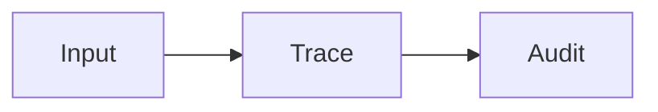

# read-md-as-html

在 VS Code 里，把 Markdown 当成精美 HTML 文档来阅读、编辑和导航。

[English README](README.md)


`read-md-as-html` 是一个本地优先的 VS Code 插件，适合长篇 Markdown 文档：研究综述、论文笔记、技术调研、设计文档，以及任何需要舒适阅读体验的 Markdown 内容。

它保持 Markdown 作为唯一主源，同时提供 HTML 阅读视图：项目文件树、目录、搜索、引用悬浮卡片、公式、Mermaid 图、增强表格、源文档行号映射、图片缩放、跨文件阅读历史、旁注批注、滑动轴预览，以及左右并排编辑。

## 动态演示


## 功能亮点

- **Markdown 与 HTML 并排**：左侧编辑 Markdown，右侧实时阅读 HTML。
- **默认专注阅读**：Markdown 栏默认折叠，阅读时优先显示 HTML 预览，需要编辑时可以随时展开。
- **栏宽可拖动**：目录、Markdown、HTML 预览三栏的边界都可以拖动。
- **双目录**：左侧固定文档目录，HTML 预览内还有可折叠目录。
- **项目 Markdown 树切换**：左侧上半部分显示当前项目所有子文件夹里的 Markdown / LaTeX 文档，下半部分显示当前文档目录，中间分界线可以拖动；当前文件所在文件夹默认展开，其他文件夹默认收起；置顶文件会平铺显示在顶部，鼠标悬浮可查看完整路径。
- **文件操作**：在项目文件树里右键文件，可以复制绝对路径或项目相对路径；HTML 预览里的 Markdown 文件链接可以直接切换同文件夹文档，其他文件夹里的文档会新开阅读标签页。
- **HTML 字号可调**：可以在工具栏里调整 HTML 预览整体字号，不会修改 Markdown 源文件。
- **内置搜索**：按 `Ctrl+F` / `Cmd+F` 打开搜索框，输入时实时高亮匹配内容；可以用 Enter / Shift+Enter 跳到下一个或上一个，也可以点击搜索框旁边的上一个/下一个按钮。
- **引用悬浮卡片**：鼠标悬浮 `[R1]` 引用，可查看标题、作者、会议/期刊、来源信息和链接。
- **小节悬浮预览**：鼠标悬浮内部小节链接，可预览目标小节内容。
- **源文档行号映射**：HTML 预览左侧可以显示源文档坐标轴，标出每个段落、图、表、公式、Mermaid 图对应 Markdown 源文件中的哪些行。
- **阅读批注**：在 HTML 预览中选中文字后，可以高亮、加入书签，或者写一段文字批注；宽预览中批注显示为带连线的右侧旁注卡，窄预览中批注改用悬浮框，避免遮挡正文。
- **智能滑动轴**：鼠标悬浮右侧滑动轴可预览对应位置的正文，点击可跳转，按住拖动可滚动；书签和批注标记保留上下文悬浮框和点击跳转。
- **公式和 Mermaid**：支持 MathJax 公式和 Mermaid 图。
- **适合研究文档的表格**：宽表格支持固定首行和首列、拖动调整列宽、右下角拖动调整表格宽高、滚动/平移查看、列筛选，并会记住每个表格的布局。
- **图片工作流**：可以直接粘贴截图，插件会保存到本地 `images/` 并自动插入 Markdown 图片语法。
- **图片和 Mermaid 放大查看**：点击打开浮层，滚轮缩放，拖动查看细节。
- **跨文件阅读位置历史**：目录跳转、滚动或切换项目内 Markdown 文件后，可以用前进/后退回到之前的文件和阅读位置。
- **持久阅读进度**：重新打开同一个 Markdown 文件时，会回到上次结束的阅读位置。
- **文档本地状态**：高亮、书签、批注写入 Markdown 文件本身；阅读进度、文件置顶状态、表格布局和导出 HTML 默认放在项目根目录唯一的 `.md/` 文件夹中。
- **长文性能优化**：项目文件列表会缓存，切换文档时尽量避免重建文件树，滚动和坐标轴更新也做了节流，适合更长的研究文档。
- **主题和语言**：支持浅色阅读、护眼、跟随 VS Code、深色主题；界面可在 English / 中文之间切换。
- **不需要后台服务**：所有功能都运行在 VS Code Webview 中。

## 界面截图


## 相比 VS Code 原生 Markdown 预览的优势

VS Code 原生 Markdown 预览很适合快速查看渲染效果。`read-md-as-html` 更偏向长文阅读、论文笔记和研究型文档管理：

| 能力 | VS Code 原生 Markdown 预览 | read-md-as-html |
| --- | --- | --- |
| 长文导航 | 文档目录和预览工作流相对分散。 | 同一阅读器里同时提供项目 Markdown 文件树、文档目录和 HTML 内目录。 |
| 跨文件阅读 | 前进/后退不会按阅读位置跨 Markdown 文件恢复。 | 前进/后退可以跨文件跳转，并恢复到之前的具体阅读位置。 |
| 搜索 | 浏览器或编辑器搜索不完全适配这个阅读器工作流。 | 内置渲染文本搜索，支持匹配数量、高亮、上一个/下一个按钮和键盘跳转。 |
| 阅读批注 | 渲染后的文档没有内置高亮、书签、文字批注层。 | 支持高亮、书签、批注、滑动轴标记、右侧旁注卡和删除操作。 |
| 引用和小节预览 | 链接主要用于打开或跳转，缺少阅读上下文。 | 引用、参考文献、小节、书签、批注和滑动轴位置都有悬浮预览。 |
| 源文档可追溯 | 渲染后的 HTML 不显示每段内容对应 Markdown 的哪些行。 | 左侧源文档坐标轴可以把段落、图、表、公式映射回 Markdown 行号，并可跳转到源文档。 |
| 宽表格阅读 | 表格可以渲染，但宽表格和大型对照表交互能力有限。 | 支持固定首行/首列、列宽调整、表格宽高调整、筛选、滚动/平移和布局持久化。 |
| 截图工作流 | 粘贴图片通常需要手动保存文件并修改 Markdown。 | 粘贴截图会保存到本地图片目录，并自动插入 Markdown 图片语法。 |
| 图像细节查看 | 图片主要是内联显示，细节查看能力有限。 | 图片和 Mermaid 图可以在浮层中放大、缩小、拖动查看。 |
| 阅读舒适度 | 适合快速检查渲染效果。 | 支持阅读主题、HTML 字号调节、默认折叠 Markdown 和可拖动分栏。 |
| 状态透明度 | 预览状态更偏编辑器或会话行为。 | 批注写入 Markdown；阅读进度、置顶文件和表格布局保存在项目根目录的 `.md/` 文件夹。 |

## 命令

```text
read-md-as-html: Open Current Markdown
read-md-as-html: Open Preview Only
read-md-as-html: Export Current Markdown as Reader HTML
```

主命令也会出现在编辑器右上角，以及 `.md` / `.markdown` / `.tex` 文件的资源管理器右键菜单中。

## 安装

安装本地 VSIX 包：

```powershell
code.cmd --install-extension .\read-md-as-html-0.0.1.vsix
```

开发调试：

```text
1. 用 VS Code 打开这个插件目录。
2. 按 F5 启动 Extension Development Host。
3. 打开一个 Markdown 文件。
4. 运行 "read-md-as-html: Open Current Markdown"。
```

## 配置项

```json
{
  "readMdAsHtml.imageDirectoryName": "images",
  "readMdAsHtml.autoSave": true,
  "readMdAsHtml.previewEditEnabledByDefault": false,
  "readMdAsHtml.theme": "reader-light",
  "readMdAsHtml.language": "zh-CN"
}
```

可选主题：

- `reader-light`
- `soft-green`
- `vscode`
- `dark`

可选语言：

- `en`
- `zh-CN`

## 存储模型

- 高亮、书签、文字批注会写到 Markdown 文件末尾的隐藏 HTML 注释块里。
- 阅读进度和表格布局保存在 `<project-root>/.md/<relative-markdown-path>.read-md-as-html.json`。
- 文件列表置顶状态保存在 `<project-root>/.md/read-md-as-html.folder.json`。
- 导出 HTML 的默认位置是 `<project-root>/.md/<relative-markdown-path>.html`。
- 创建项目根目录 `.md/` 缓存文件夹时，插件会同时确保 `<project-root>/.gitignore` 包含 `.md/`。
- 插件不会故意把批注或阅读进度继续保存在 VS Code 系统缓存中；旧的 `workspaceState` 数据会在打开文档时迁移。

## Markdown 文档生成规范

插件最适合结构稳定的 Markdown 文档。目标是让 Markdown 源文件本身可读，同时能可靠转换成舒适的 HTML 阅读页。

### 基本原则

- Markdown 是主源。
- 使用 UTF-8。
- 尽量使用标准 Markdown 语法。
- 避免不必要的原生 HTML。
- 图片和资源放在 Markdown 同级目录或附近的子目录中。
- 粘贴图片默认保存到 `images/`。
- 使用相对路径，不使用绝对本地路径。
- 不把图片保存成 base64。

推荐目录结构：

```text
project/
  docs/
    survey.md
    images/
      trace-graph.png
      pasted-20260607-153012-123.png
```

### 推荐文档结构

```markdown
# 标题

> 写作日期：YYYY-MM-DD
> 范围：本文覆盖的数据源、论文、代码库或系统。

## 1. 背景与问题
## 2. 核心概念
## 3. 方法或系统分类
## 4. 对比表
## 5. 工程启发
## 6. 空白与后续问题
## 参考文献

[R1] 作者. *标题*. 来源, 年份. URL
```

长文档中，每个主要小节通常应该回答：

- 这个小节回答什么问题？
- 覆盖了哪些来源或相关工作？
- 使用了什么方法、证据或对比？
- 有哪些局限？
- 它和本文主题有什么关系？

### 标题与锚点

使用标准 Markdown 标题：

```markdown
# 文档标题
## 1. 一级小节
### 1.1 二级小节
```

规则：

- 不要跳过标题层级。
- 标题要可读，不要只有编号。
- 长文档建议使用编号标题。
- 需要稳定链接的小节可以显式写锚点：

```markdown
## 2.2 OpenTelemetry：重要底座 {#opentelemetry-foundation}
```

内部链接示例：

```markdown
参见 [OpenTelemetry 小节](#opentelemetry-foundation)。
```

### 引用与参考文献

正文中使用 `[R数字]` 引用：

```markdown
HarnessAudit 指出，只看最终输出会漏掉轨迹中的越权行为 [R9]。
多个引用可以连续写 [R10][R14][R46]。
```

参考文献放在 `## 参考文献` 小节下：

```markdown
[R9] Chengzhi Liu et al. *Auditing Agent Harness Safety*. arXiv:2605.14271, 2026. https://arxiv.org/abs/2605.14271
```

推荐字段顺序：

```text
[R编号] 作者. *标题*. 出版源或说明, 年份. URL
```

规则：

- 每个引用编号唯一。
- 正文中的每个引用都要能找到对应参考文献条目。
- 文献标题用 `*标题*` 包裹。
- 作者放在标题前面。
- 如果没有作者，可以直接从标题开始，但不要编造作者。
- URL 放在条目末尾。

可接受的无作者格式：

```markdown
[R16] *Agent Trace: Open Specification for Tracking AI-Generated Code*. Version 0.1.0 RFC, 2026. https://agent-trace.dev/
```

显式作者字段格式：

```markdown
[R1] Authors: Adam AlSayyad, Kelvin Yuxiang Huang, Richik Pal. *AgentTrace: A Structured Logging Framework for Agent System Observability*. arXiv:2602.10133, 2026. https://arxiv.org/abs/2602.10133
```

### 公式

行内公式：

```markdown
其中 $S$ 是 trace surface，$E$ 是事件内容。
```

块级公式：

```markdown
$$
L(S,E,C)\to R
$$
```

规则：

- 块级公式前后留空行。
- 不要在公式里混入 Markdown 链接。
- 变量首次出现时在正文中解释。

### 图片

使用标准 Markdown 图片语法。为了避免打包工具把 README 示例误判成真实坏链，下面示例故意加了空格：

```markdown
! [Trace graph overview] (images/trace_graph.png)
```

真实写作时，删除 `!` 后面和 `(` 前面的空格。

规则：

- 图片路径使用相对路径。
- 图片放在 `images/` 或合适的资源目录中。
- `alt` 文本写成可读说明。
- 不使用 base64 图片数据。
- 文件名尽量使用小写英文、数字、短横线和下划线。

推荐命名：

```text
images/memory-lineage-graph.png
images/agent-trace-pipeline.png
images/pasted-20260607-153012-123.png
```

避免：

```text
images/screenshot 1 (final).png
C:\Users\name\Desktop\figure.png
data:image/png;base64,...
```

### Mermaid

使用 fenced Mermaid 代码块：

````markdown

````

规则：

- Mermaid 代码块前后留空行。
- 节点文本尽量短。
- 中文节点建议放在引号里。
- 长解释放在图前或图后，不塞进图里。
- Mermaid 用于结构、流程、依赖、分类。

### 表格、列表与代码

使用标准 Markdown 表格：

```markdown
| 工作 | 关注点 | 启发 |
| --- | --- | --- |
| MemLineage [R10] | memory lineage | 需要保留派生链 |
```

代码块注明语言：

````markdown
```json
{"trace_id": "abc", "event": "memory_write"}
```
````

规则：

- 表格单元格尽量短。
- 不使用跨多行表格单元格。
- 长解释放在表格外。
- 避免深层嵌套列表。
- 代码块只放代码、配置或结构化示例。

### 写作风格

- 先说明问题，再介绍方法。
- 先给结论，再给证据。
- 概念首次出现时解释清楚。
- 不要把引用堆在段尾而不说明引用支持什么。
- 长段落拆短，方便 HTML 阅读。

### 生成后检查清单

- 标题层级连续。
- 目录结构清楚。
- 显式锚点唯一。
- 图片路径是相对路径。
- 图片文件存在。
- Mermaid 代码块闭合。
- 公式分隔符闭合。
- 表格分隔行正确。
- 正文引用都有参考文献条目。
- 参考文献标题用 `*标题*` 包裹。
- 参考文献作者、标题、来源、年份、URL 清楚。
- 没有不必要的原生 HTML 或 base64 图片。

## 打包

生成 VSIX：

```powershell
npx.cmd --yes @vscode/vsce@latest package --no-dependencies
```

## 发布

发布到 VS Code Marketplace 前：

- 替换 `package.json` 里的占位 `publisher`。
- 添加 `repository` 字段。
- 添加 `LICENSE` 文件。

```powershell
npx.cmd --yes @vscode/vsce@latest login <publisher-id>
npx.cmd --yes @vscode/vsce@latest publish --no-dependencies
```

也可以在 Visual Studio Marketplace publisher 管理页面手动上传 `.vsix`。

## Roadmap

- 内置本地 MathJax 和 Mermaid 资源，支持离线使用。
- 多文档项目导航。
- 更丰富的 HTML 导出模式。
- 对复杂 Markdown 块提供更好的预览编辑。
- 更多主题和布局预设。
